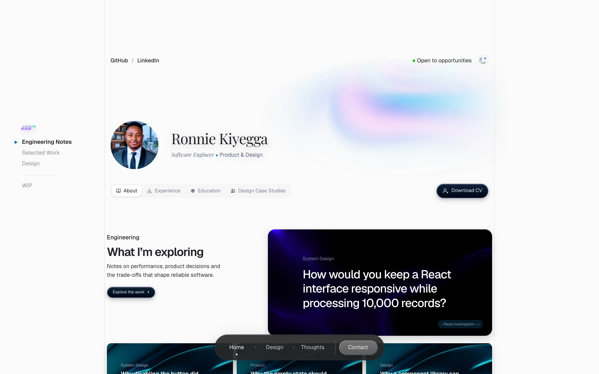

# Ronnie Kiyegga — Portfolio

My personal portfolio: selected engineering work, interface design, product
thinking and articles on building software.

[Visit the website](https://www.ronniekiyegga.com)



## Design

A quiet, editorial layout so the work leads. The design files are in
[Figma](https://www.figma.com/design/0wURLIqsRo6YCvukM6o8t1/Design-Work?node-id=0-1).

- **Layout** — a single 852px reading column. Each section pairs a small
  `/ Label` with its content on a two-column grid, so the page scans like
  an index.
- **Typography** — Playfair Display for the name and article titles, Geist
  for interface and body text, and an Italianno signature in the footer.
- **Design archive** — `/design` collects interfaces, components and
  experiments, filterable by category, viewable as a grid or a spiral, with a
  keyboard-accessible lightbox.
- **Motion** — sections fade in on scroll, with WebGL accents on the hero and
  primary buttons. The scroll reveals and background shader respect a
  reduced-motion preference.
- **Scale** — desktop renders 10% larger (CSS `zoom`, with viewport units and
  breakpoints compensated) so the layout matches its intended density;
  phones are unchanged.

## Built with

Next.js (App Router), React, TypeScript and Tailwind CSS, deployed on Vercel.

- `app/(home)/` — the routes (`/`, `/design`, `/thoughts`, `/thoughts/[slug]`),
  with each page section's components and data in `_features/<feature>/`.
- `content/thoughts/` — one source file per article; a duplicated slug fails
  the build.
- `shared/components/` — the site shell, navigation and reusable UI.
- `lib/` — utilities and the Redis-backed visitor counter.

## Run locally

Requires Node.js 24 and pnpm 12 (pinned in `package.json`).

```bash
pnpm install --frozen-lockfile
pnpm dev
```

Then open [http://localhost:3000](http://localhost:3000).

No environment variables are required. The visitor counter is optional: set
`KV_REST_API_URL` and `KV_REST_API_TOKEN` in `.env.local` to enable it;
without them it is skipped.

## Checks

The same checks run in CI on every push and pull request to `main`:

```bash
pnpm exec tsc --noEmit
pnpm lint
pnpm test
pnpm build
```

Tests cover article-content integrity (one definition per slug, every listed
article resolves, routes and redirects) and the visitor counter.
